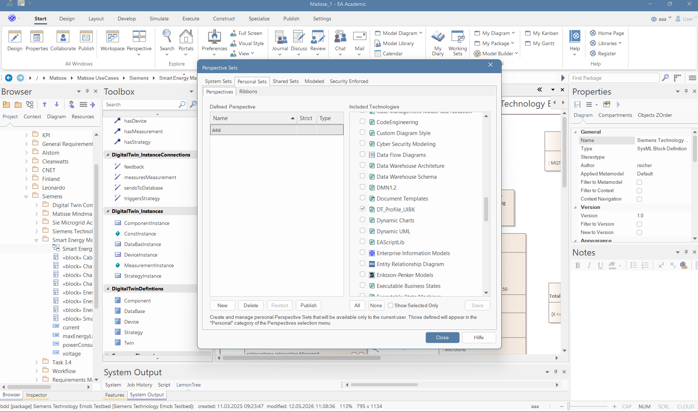
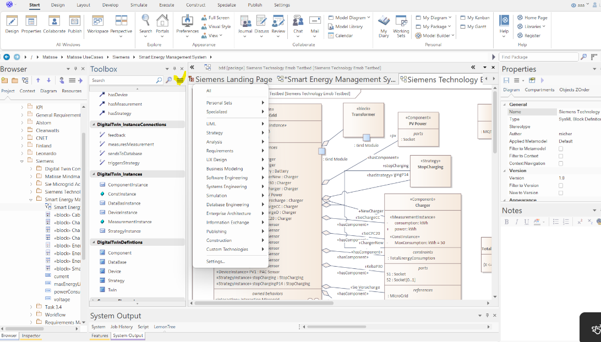

# TwinMind — A Modelling Copilot for Digital Twins

**TwinMind** is an AI-powered modelling copilot that bridges natural language and formal system modelling. It takes human-written descriptions of systems, components, or behaviours, understands their structure and semantics, and automatically generates SysML v1 models inside Enterprise Architect — no manual diagram-drawing required.

## How it works

The user provides a plain-text description of a system — for example, a microgrid, a cyber-physical device, or any other engineered system. TwinMind processes this input using a [LangChain](https://docs.langchain.com/oss/python/langchain/agents) agent pipeline that interprets the described entities, relationships, and properties. The agent then interacts with Enterprise Architect via a dedicated MCP server, programmatically constructing a structured SysML model from the extracted information.

All generated models conform to the **UIBK SysML v1 Digital Twin Library** ([`cloud-DTs/SysML2CMAdapter`](https://github.com/cloud-DTs/SysML2CMAdapter)), ensuring that the output is consistent with the established Digital Twin profile used at the University of Innsbruck — including stereotypes, tagged values, and architectural conventions defined in that library.

## Importing the SysML Library into EA
Import the file ./SysMlLibrary/dt_profile_UIBK as descirbed in
https://sparxsystems.com/enterprise_architect_user_guide/17.1/modeling_frameworks/importmdgtechnologies.html

After that go to Start -> Perspective -> Settings -> Personal Sets then you have this settings in the following image

Here you cann add a new Perspective like this Example "aaa". For this perspective tick the UIBK profile on the right side.
After that go to the diagram:

Here you can click on the menu button then you can select "Change Persepective". Then select your created Perspective like "aaa". After that you can click again and select the profile. After that you can use the components of it.
## Key Components

| Component | Role |
|---|---|
| **Natural language understanding** | LangChain agents parse and decompose the user's input into modelling-relevant concepts |
| **Enterprise Architect integration** | An EA MCP server exposes the EA automation API, allowing the agent to create packages, blocks, ports, connectors, and stereotypes programmatically |
| **UIBK Digital Twin profile** | Generated models are grounded in the SysML v1 Digital Twin Library, guaranteeing structural validity and reusability within the broader UIBK toolchain |
## Useful Technologies
* Cherry Studio. With this the tool can ue multiple LLM models
* Langchain
* MCP EA https://www.sparxsystems.jp/en/MCP/

